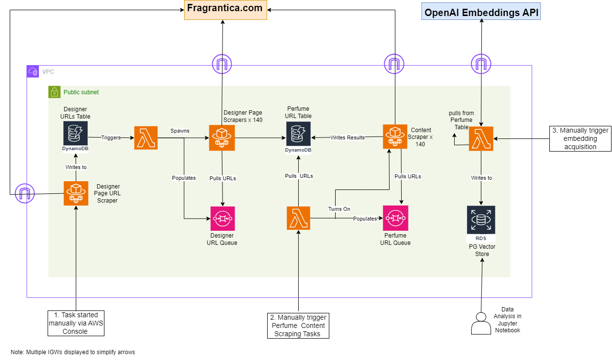

* `cdk deploy` deploys this stack to your default AWS account/region
* The `cdk.json` file tells the CDK Toolkit how to execute the app
* `lib/oud-stack.ts` defines all of the AWS infrastructure
* the data-exploration folder was for ad-hoc analysis, so it's unorganized

## Architecture Diagram
